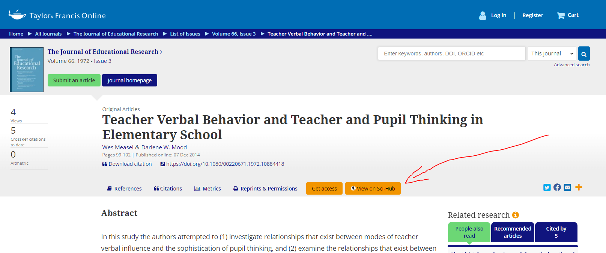

# Sci-Hub injector extension

## Supported sites

- PubMed
- Nature
- Science Direct
- Taylor & Francis
- Springer Link (article, book, chapter, protocol, reference work)
- Cochrane Library
- Google scholar

### Journal screenshots





## Development

### Commands

Build for production

```bash
npm run build
```

Build for development (with file watcher)

```bash
npm run build:dev
```

### Add new journal site

1. Add matches to `manifest.json`
2. Add page analyzer (`src/util/`)
3. Add page injector (`src/util/`)
4. Add using of the new created page injector (`src/index.ts`)
5. Update README.md (`Supported sites`, `Journal screenshots`, `Examples url for testing`)

## Tests

### For testing on firefox

1. Open Firefox
2. Enter `about:debugging` in the URL bar
3. Click `This firefox`
4. Click `Load temporary Add-on`
5. Open the extension's directory and select `manifest.json` file

### For testing on Chrome

1. Open Chrome
2. Enable `Developer mode` by ticking the checkbox in the upper-right corner.
3. Enter `chrome://extensions`
4. Click `Load unpacked extension`
5. Select the extension's directory

### Examples url for testing :

- PubMed : https://pubmed.ncbi.nlm.nih.gov/28673424
- Nature : https://www.nature.com/articles/144672b0
- Science Direct : https://www.sciencedirect.com/science/article/abs/pii/S187943781630016X
- Taylor & Francis : https://www.tandfonline.com/doi/abs/10.1080/00220671.1972.10884418
- Springer Link (Article) : https://link.springer.com/article/10.1007/s40278-018-42901-5
- Springer Link (Book, Chapter, Protocol, Reference Work) : https://link.springer.com/book/10.1007/978-3-642-14691-6
- Cochrane Library : https://www.cochranelibrary.com/cdsr/doi/10.1002/14651858.CD006403.pub2/full
- Google scholar : https://scholar.google.com/scholar?hl=fr&as_sdt=0%2C5&q=measles+systematic+review&btnG=&oq=measles+syst

## Contributing

Feel free to make a pull requests !
